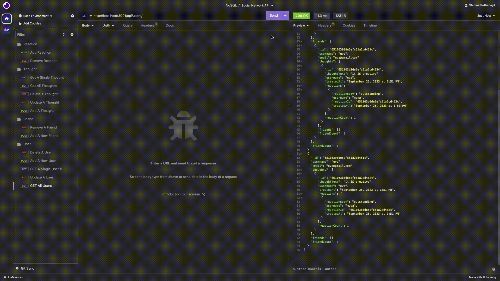
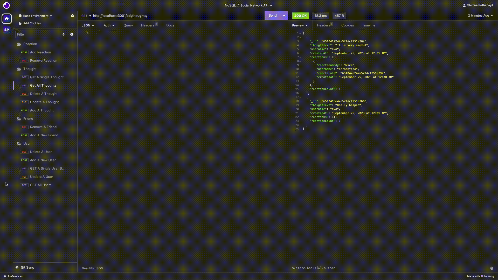
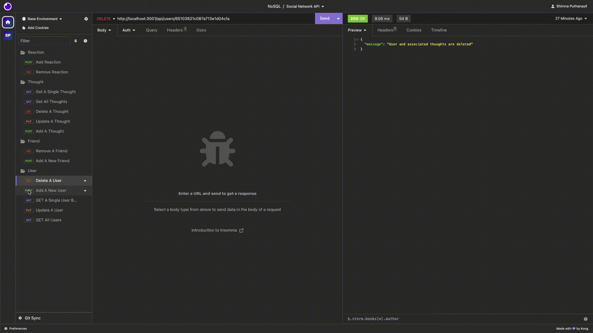
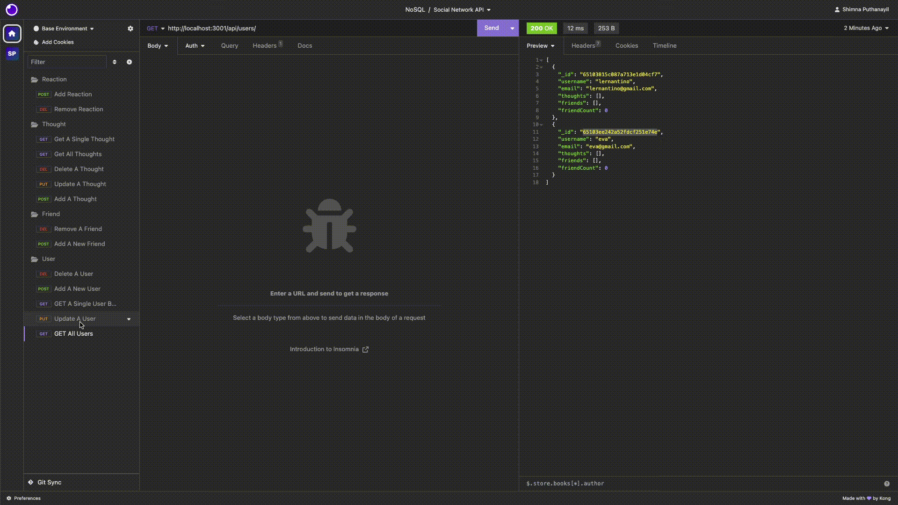
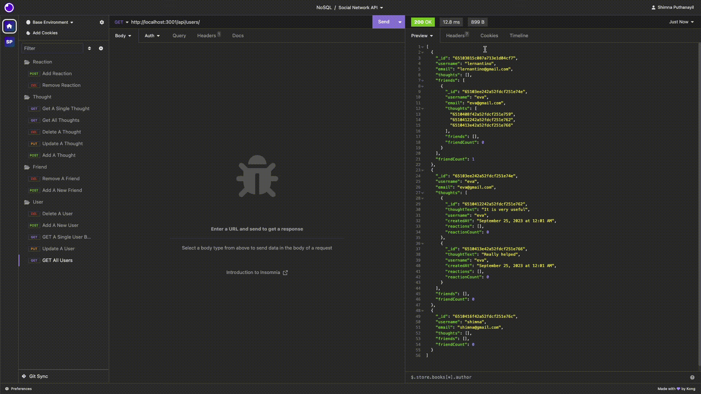
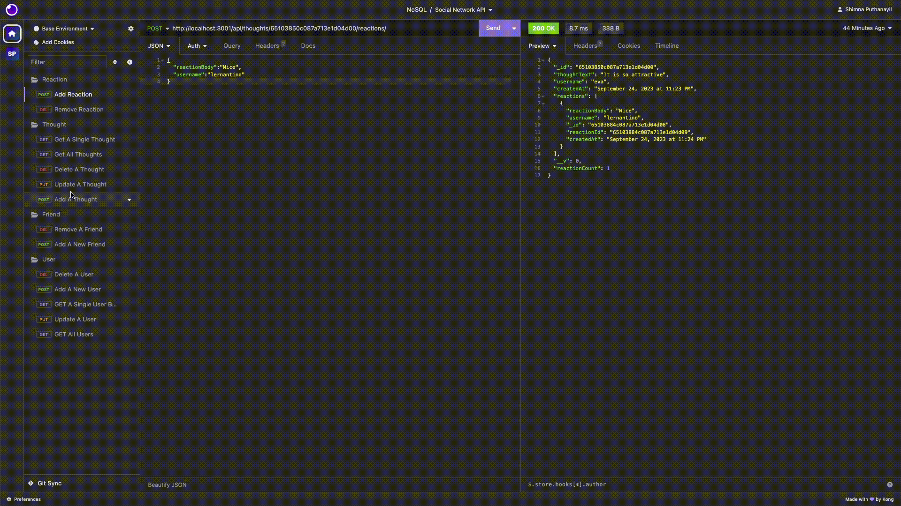

# Social Network API

[](https://opensource.org/licenses/MIT)

## Description

The project helps to build an API for a social network web application where users can share their thoughts, react to friends’ thoughts, and create a friend list. The application is built using Express.js for routing, a MongoDB database and the Mongoose ODM.

## Installation

- Install Node.js v16
- Install MongoDB
- Clone the Repository from GitHub and navigate to the root directory
- Install necessary dependencies running the following command :

  ```
  npm i
  ```

## Usage

The application can be invoked in the terminal by using the following command:

```
npm start
```

When the application is invoked using 'npm start' then the API server will start listening on port 3001 and the routes can be tested in Insomnia.

#### Link to walkthrough video :

https://drive.google.com/file/d/1G-FvFIqWr-vTPKWlEIuiaoI3vNb6Eo3j/view?usp=sharing

#### API Routes

<pre>
<b>/api/users/</b>

    <b> GET</b> all users
     <b>POST</b> a new user

<b>/api/users/:userId</b>

     <b>GET</b> a single user by its \_id and populated thought and friend data
     <b>PUT</b> to update a user by its \_id
     <b>DELETE</b> to remove user by its \_id

<b>/api/users/:userId/friends/:friendId</b>

     <b>POST</b> to add a new friend to a user's friend list
     <b>DELETE</b> to remove a friend from a user's friend list

<b>/api/thoughts</b>

     <b>GET</b> to get all thoughts
     <b>POST</b> to create a new thought

<b>/api/thoughts/:thoughtId</b>

     <b>GET</b> to get a single thought by its \_id
     <b>PUT</b> to update a thought by its \_id
     <b>DELETE</b> to remove a thought by its \_id

<b>/api/thoughts/:thoughtId/reactions</b>

     <b>POST</b> to create a reaction stored in a single thought's reactions 
     array field

<b>/api/thoughts/:thoughtId/reactions/:reactionId</b>

     <b>DELETE</b> to pull and remove a reaction by the reaction's reactionId value
</pre>

The following images show the application's appearance and functionality :

**GET** route to return **All The Users** and **All the Thoughts** being tested in Insomnia Core:



**GET** routes to return a **Single User** and a **Single Thought** by its id being tested in Insomnia Core:



**POST**, **PUT**, and **DELETE** routes for **User** being tested in Insomnia Core:



**POST**, **PUT**, and **DELETE** routes for **Thought** being tested in Insomnia Core:



**POST** and **DELETE** routes for **Friends** being tested in Insomnia Core:



**POST** and **DELETE** routes for **Reactions** being tested in Insomnia Core:



## Credits

#### References

https://stackoverflow.com/questions/18022365/mongoose-validate-email-syntax

https://stackoverflow.com/questions/8888491/how-do-you-display-javascript-datetime-in-12-hour-am-pm-format

https://mongoosejs.com/docs/populate.html

https://mongoosejs.com/docs/validation.html

## License

[MIT](https://opensource.org/licenses/MIT) license.
